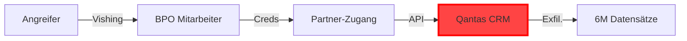
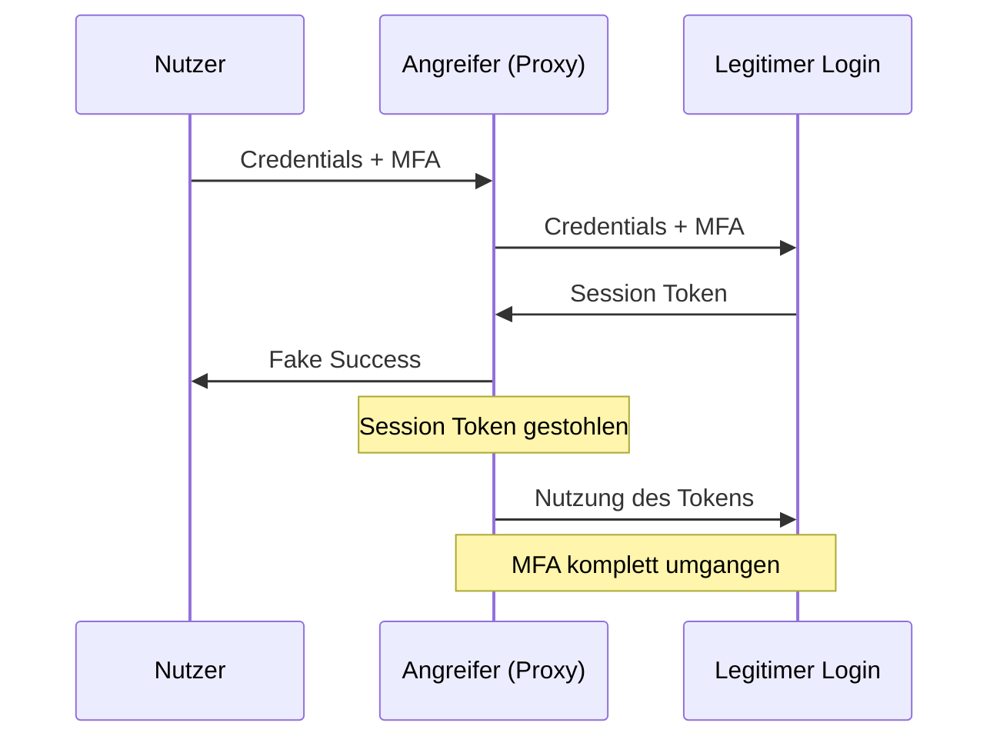
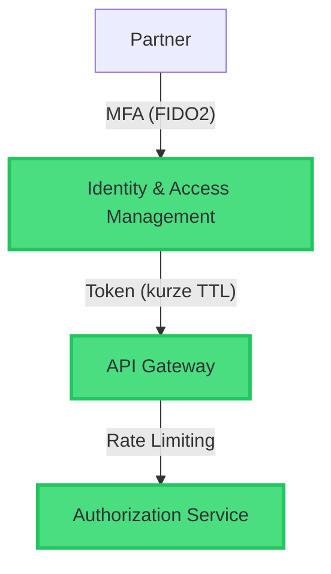
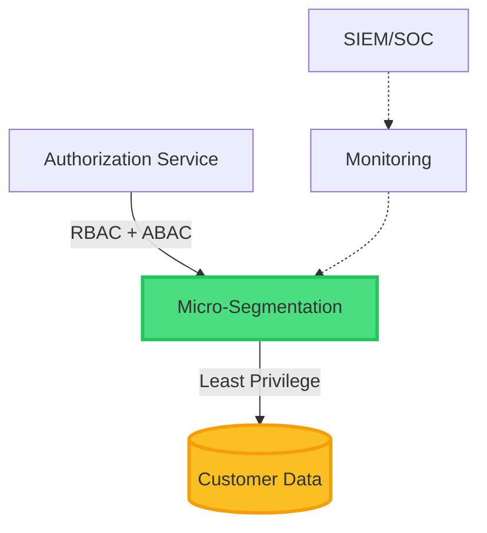

# Qantas Supply Chain Breach

<div class="pt-12">
  <span class="text-6xl font-bold bg-gradient-to-r from-red-500 to-orange-600 bg-clip-text text-transparent">
    2025
  </span>
</div>

<div class="pt-12 text-xl opacity-70">
Fallstudie eines Identity-First Supply Chain Angriffs
</div>

<!--
Willkommen zur Analyse des Qantas-Vorfalls von 2025 – einem Paradebeispiel für moderne Supply-Chain-Angriffe
-->

---
layout: default
---

# Einordnung & Kontext

<div class="grid grid-cols-2 gap-8 mt-8">

<div>

## Angriffstyp
<v-clicks>

- **Supply-Chain-Angriff**
- Partner-Kompromittierung
- Identity-First Vektor
- Implicit Trust Exploitation

</v-clicks>

</div>

<div>

## Betroffene Systeme
<v-clicks>

- Qantas CRM-Backend
- Vielflieger-Datenbank
- ~6 Mio. Kundendatensätze
- BPO-Partner (Philippinen)

</v-clicks>

</div>

</div>

<div v-click class="mt-8 p-4 bg-red-500/10 border-l-4 border-red-500 rounded">
Kernproblem: Vertrauen ohne Verifikation (Implicit Trust Relationships)
</div>

<div v-click class="mt-4 p-4 bg-gray-500/10 border-l-4 border-gray-400 rounded text-sm">
<strong>CVE/CVSS:</strong> Kein spezifischer CVE — kein klassischer Software-Bug · Klassifizierung: <strong>OWASP API Security Top 10 #1 — BOLA</strong> (Broken Object Level Authorization)
</div>

<!--
Supply-Chain-Angriffe zielen nicht direkt auf die Hauptinfrastruktur, sondern kompromittieren Partner mit legitimen Zugängen.
Der Fokus liegt auf Identity-Missbrauch, nicht auf Code-Schwachstellen.
-->

---
layout: default
---

# Relevanz: Supply Chain Angriffe

<div class="grid grid-cols-2 gap-8 mt-8">

<div>

## Bedrohungslage

<v-clicks>

- Vervierfachung der Angriffe 2020 → 2021 (ENISA)
- Ø **4,88 Mio. USD** Schadenskosten je Vorfall (IBM 2024)
- Drittanbieter als zunehmend kritischer Angriffsvektor

</v-clicks>

</div>

<div>

## Bekannte Fälle

<v-clicks>

- **SolarWinds (2020)** — Staatliche Akteure, ~18.000 Ziele
- **MOVEit (2023)** — Cl0p-Gruppe, 2.700+ Organisationen
- **MGM Resorts (2023)** — Scattered Spider
- **Qantas (2025)** — Scattered Spider (vermutet)

</v-clicks>

</div>

</div>

<v-click>

<div class="mt-8 p-4 bg-orange-500/10 border-l-4 border-orange-500 rounded">
Trend: Angreifer umgehen direkte Unternehmensverteidigung über schwächere Partner im Ökosystem
</div>

</v-click>

<!--
Supply-Chain-Angriffe sind zu einem der dominierenden Angriffsvektoren geworden. Statt in gepanzerte Ziele einzubrechen, greifen Angreifer über vertrauenswürdige Partner an.
-->

---
layout: two-cols
layoutClass: gap-8
---

# Das Ökosystem

<v-clicks>

## Ziel
- Qantas CRM-Backend
- Vielflieger-Stammdaten
- Sensible PII-Daten

## Einstiegspunkt
- BPO-Dienstleister
- Philippinisches Callcenter
- Legitimer Partner-Zugang

</v-clicks>

::right::

<v-click>

## Bedrohungsakteur

<div class="mt-4 p-4 bg-orange-500/10 border border-orange-500/30 rounded">

**Profil**
- Finanziell motiviert
- Scattered Spider (vermutet)
- Hochentwickeltes Social Engineering
- Spezialisiert auf Identity-Angriffe

</div>

</v-click>

<!--
Das Ökosystem zeigt die Abhängigkeit von Drittanbietern. Der Angreifer nutzt legitime Vertrauensstellungen aus.
-->

---
layout: default
---

# Attack Flow



<div class="mt-8 grid grid-cols-5 gap-4 text-sm">

<div class="text-center">
<div class="font-bold">Phase 1</div>
<div class="opacity-70">Social Engineering</div>
</div>

<div class="text-center">
<div class="font-bold">Phase 2</div>
<div class="opacity-70">Credential Theft</div>
</div>

<div class="text-center">
<div class="font-bold">Phase 3</div>
<div class="opacity-70">Unauthorized Access</div>
</div>

<div class="text-center">
<div class="font-bold">Phase 4</div>
<div class="opacity-70">API Exploitation</div>
</div>

<div class="text-center">
<div class="font-bold">Phase 5</div>
<div class="opacity-70">Data Exfiltration</div>
</div>

</div>

<!--
Der komplette Attack Flow von Social Engineering bis zur Exfiltration. Phase 3 beschreibt den direkten Zugriff über gestohlene Partner-Credentials auf das Qantas-System – kein klassisches Lateral Movement im Netzwerk, sondern gezielter API-Zugriff über legitime Vertrauensstellung.
-->

---
layout: default
---

# Initial Access: Social Engineering

<div class="grid grid-cols-2 gap-8 mt-8">

<div>

## Vishing (Voice Phishing)

<v-clicks>

- Telefon-basierter Angriff
- Zielpersonen: Callcenter-Mitarbeiter
- Psychologischer Druck
- **Credential Harvesting**

</v-clicks>

<v-click>

<div class="mt-6 p-4 bg-blue-500/10 border-l-4 border-blue-500 rounded text-sm">
<strong>Credential Harvesting:</strong> Systematisches Sammeln von Anmeldedaten durch Social Engineering oder technische Mittel
</div>

</v-click>

</div>

<div>

## MFA-Umgehung

<v-clicks>

### MFA-Fatigue
- Push-Notification-Flooding
- Nutzer-Erschöpfung
- Unaufmerksame Bestätigung

### Warum funktioniert das?
- Menschliche Schwäche
- Keine Kontextprüfung
- Phishable MFA (Push/SMS)

</v-clicks>

</div>

</div>

<!--
Vishing kombiniert Telefon und psychologische Manipulation. MFA-Fatigue nutzt menschliche Ermüdung aus – ein klassisches Design-Problem von Push-basierten MFA-Systemen.
-->

---
layout: center
class: text-center
---

# Session Hijacking

<div class="mt-12">

## Adversary-in-the-Middle (AiTM)

<v-click>



</v-click>

</div>

<v-click>

<div class="mt-8 p-6 bg-red-500/10 border border-red-500/30 rounded">
<strong>Session Token:</strong> Digitaler Schlüssel einer authentifizierten Sitzung – ersetzt Credentials nach Login. Mit dem Token ist MFA irrelevant.
</div>

</v-click>

<!--
AiTM ist hocheffektiv: Der Angreifer sitzt zwischen Nutzer und echtem Login-Server, fängt alle Daten ab – inklusive Session-Token. MFA wird dadurch wertlos.
-->

---
layout: default
---

# API-Schwachstelle: BOLA

<div class="grid grid-cols-2 gap-8 mt-6">

<div>

## Broken Object Level Authorization

<v-click>

### OWASP API Security #1

- **Problem:** Server prüft WER, nicht WORAUF
- Fehlende Autorisierung auf Objekt-Ebene
- Nur Authentifizierung, keine Ownership-Prüfung

</v-click>

<v-click>

### Exploitation

```http
GET /api/customer/12345
Authorization: Bearer <partner_token>

GET /api/customer/12346
GET /api/customer/12347
```

</v-click>

</div>

<div>

<v-click>

## ID-Enumeration

<div class="mt-4 p-4 bg-yellow-500/10 border border-yellow-500/30 rounded text-sm">

**Methode**
- Systematisches Durchprobieren
- Skript-gesteuert
- Sequentielle IDs

```python
for id in range(1, 10000000):
    fetch(f"/api/customer/{id}")
```

</div>

</v-click>

</div>

</div>

<!--
BOLA ist die häufigste API-Schwachstelle. Die Logik prüft nur ob jemand eingeloggt ist, nicht ob er auf DIESE Daten zugreifen darf.
-->

---
layout: default
---

# Massen-Exfiltration

<v-click>

## Fehlende Sicherheitskontrollen

<div class="grid grid-cols-3 gap-6 mt-8">

<div class="p-4 bg-red-500/10 border border-red-500/30 rounded">
<strong>Kein Rate Limiting</strong>
<div class="text-sm mt-2 opacity-70">Begrenzung der Anfragen pro Zeiteinheit fehlt</div>
</div>

<div class="p-4 bg-red-500/10 border border-red-500/30 rounded">
<strong>Kein Throttling</strong>
<div class="text-sm mt-2 opacity-70">Keine Drosselung bei verdächtigem Verhalten</div>
</div>

<div class="p-4 bg-red-500/10 border border-red-500/30 rounded">
<strong>Keine Anomalie-Erkennung</strong>
<div class="text-sm mt-2 opacity-70">Massenhafte API-Calls unbemerkt</div>
</div>

</div>

</v-click>

<v-click>

## Mass Assignment


**Skript-gesteuerter Datenabzug:**
- Millionen von Datensätzen in Stunden
- Automatisierte Enumeration
- Tarnung durch autorisierten Partner-Kanal


</v-click>

<!--
Ohne Rate Limiting können Angreifer beliebig viele Anfragen stellen. Der Traffic lief über autorisierte Partner-Verbindungen und löste keine Alarme aus.
-->

---
layout: default
---

# Schadensanalyse

<div class="grid grid-cols-2 gap-8 mt-6">

<div>

## Datenumfang

<v-click>

- **6 Millionen** Kundendatensätze
- Namen, Geburtsdaten, E-Mails
- Telefonnummern
- Vielflieger-Status

</v-click>

<v-click>

## PII & Identity Starter Kits

<div class="mt-4 text-sm">

**Personally Identifiable Information**

- Name + DOB + E-Mail = "Starter Kit"
- Ermöglicht Identitätsdiebstahl
- Basis für Spear-Phishing

</div>

</v-click>

</div>

<div>

<v-click>

## Regulatorische Folgen

**Australian Privacy Act**

- Meldepflicht bei Data Breaches
- Drakonische Strafen bei Fahrlässigkeit
- Reputationsschaden

</v-click>

<v-click>

## Wirtschaftlicher Schaden

<div class="mt-4 text-sm">

- Forensik & Incident Response
- Rechtsberatung & Compliance
- Kundenkommunikation
- Marktwert-Verlust

</div>

</v-click>

</div>

</div>

<!--
Die entwendeten Daten sind hochwertig für Folgeangriffe. Identity Starter Kits ermöglichen täuschend echte Identitätsfälschungen.
-->

---
layout: default
---

# Qantas Reaktion & Incident Response

<div class="grid grid-cols-2 gap-8 mt-6">

<div>

## Sofortmaßnahmen

<v-clicks>

- Partnerzugang sofort gesperrt
- Forensik-Untersuchung eingeleitet
- Betroffene Kunden per E-Mail informiert
- Kooperation mit OAIC und Behörden

</v-clicks>

</div>

<div>

## Eingrenzung des Schadens

<v-clicks>

- Keine Zahlungsdaten betroffen
- Keine Passwörter kompromittiert
- Keine Reisedokumente gestohlen
- Keine Frequent-Flyer-Passwörter exponiert

</v-clicks>

</div>

</div>

<v-click>

<div class="mt-8 p-4 bg-blue-500/10 border-l-4 border-blue-500 rounded text-sm">
<strong>Quelle:</strong> Offizielles Update-Statement Qantas, 9. Juli 2025 — schnelle Reaktion als Zeichen funktionierendes Incident Response Management
</div>

</v-click>

<!--
Die schnelle Reaktion von Qantas zeigt Incident Response Management in der Praxis. Der betroffene Partnerzugang wurde sofort getrennt, Kunden informiert und Behörden eingebunden.
-->

---
layout: center
class: text-center
---

# Lessons Learned

<div class="text-2xl mt-12 mb-8 opacity-70">
Technische & organisatorische Gegenmaßnahmen
</div>

---
layout: default
---

# Prävention: FIDO2 & WebAuthn

<div class="grid grid-cols-2 gap-8 mt-6">

<div>

## Phishable MFA (Problem)

<v-clicks>

- SMS-basiert
- Push-Notifications
- Time-based Codes (TOTP)

**Schwächen:**
- Anfällig für Social Engineering
- Session Hijacking möglich

</v-clicks>

</div>

<div>

## FIDO2/WebAuthn (Lösung)

<v-clicks>

- Kryptografie mit öffentlichem Schlüssel
- Hardware-gebundene Authentifizierung
- Physischer Sicherheitsschlüssel

**Vorteile:**
- Technisch unphishbar
- Kein Credential Theft möglich

</v-clicks>

</div>

</div>

<v-click>

<div class="mt-8 p-4 bg-green-500/10 border border-green-500/30 rounded text-sm">

**Wie funktioniert FIDO2?** Challenge-Response mit privatem Schlüssel – der Schlüssel verlässt nie das Hardware-Token

</div>

</v-click>

<!--
FIDO2 macht Phishing technisch unmöglich, da der private Schlüssel nie das Hardware-Token verlässt. Vishing und AiTM laufen ins Leere.
-->

---
layout: default
---

# Zero Trust Architecture

<v-click>

## "Never Trust, Always Verify"

<div class="grid grid-cols-2 gap-8 mt-6">

<div class="p-6 bg-red-500/10 border border-red-500/30 rounded">

### Traditionelles Modell

- Perimeter-basierte Sicherheit
- Implizites Vertrauen nach Login
- Pauschale Partner-Zugänge
- "Inside vs. Outside" Denken

</div>

<div class="p-6 bg-green-500/10 border border-green-500/30 rounded">

### Zero Trust Modell

- Continuous Verification
- Kein implizites Vertrauen
- Micro-Segmentation
- Least Privilege Prinzip

</div>

</div>

</v-click>

<!--
Zero Trust bedeutet: Auch Partner werden wie potenzielle Bedrohungen behandelt. Jeder Zugriff muss kontinuierlich verifiziert werden.
-->

---
layout: default
---

# Technische Architektur: Übersicht



<v-click>

<div class="mt-6 text-sm opacity-70">
TTL: Time To Live (kurze Token-Laufzeiten reduzieren Missbrauchsrisiko)
</div>

</v-click>

<!--
Die erste Hälfte der Architektur: Von Partner-Zugriff bis zur Authorization
-->

---
layout: default
---

# Technische Architektur: Data Layer



<v-click>

<div class="mt-6 text-sm opacity-70">
RBAC: Role-Based Access Control | ABAC: Attribute-Based Access Control
</div>

</v-click>

<!--
Die zweite Hälfte: Von Authorization zum Data Layer mit kontinuierlichem Monitoring
-->

---
layout: center
class: text-center
---

# Fazit

<div class="mt-12 space-y-8">

<v-click>

<div class="text-2xl font-bold bg-gradient-to-r from-red-700 to-red-900 bg-clip-text text-transparent">
Identität ist der neue Sicherheitsperimeter
</div>

</v-click>

<v-click>

<div class="text-xl opacity-80">
Supply Chain Risk Management ist kritische Infrastruktur
</div>

</v-click>

<v-click>

<div class="text-xl opacity-80">
Technik muss menschliches Versagen antizipieren
</div>

</v-click>

</div>

<!--
Der Qantas-Fall zeigt: Traditionelle Sicherheitsmodelle versagen bei Supply-Chain-Angriffen.
-->

---
layout: center
class: text-center
---

# Kernerkenntnisse

<div class="mt-12 grid grid-cols-3 gap-8 text-left">

<v-click>

<div class="p-6 bg-gradient-to-br from-green-500/10 to-emerald-500/10 border border-green-500/30 rounded-lg">
<div class="text-lg font-bold mb-2">FIDO2 ist Pflicht</div>
<div class="text-sm opacity-70">Phishable MFA ist obsolet</div>
</div>

</v-click>

<v-click>

<div class="p-6 bg-gradient-to-br from-blue-500/10 to-cyan-500/10 border border-blue-500/30 rounded-lg">
<div class="text-lg font-bold mb-2">Zero Trust umsetzen</div>
<div class="text-sm opacity-70">Kein implizites Vertrauen</div>
</div>

</v-click>

<v-click>

<div class="p-6 bg-gradient-to-br from-purple-500/10 to-pink-500/10 border border-purple-500/30 rounded-lg">
<div class="text-lg font-bold mb-2">API Security</div>
<div class="text-sm opacity-70">BOLA & Rate Limiting prüfen</div>
</div>

</v-click>

</div>

<!--
Die drei zentralen Takeaways aus dieser Fallstudie
-->

---
layout: center
class: text-center
---

# Danke für die Aufmerksamkeit

<div class="mt-16 text-2xl opacity-70">
Fragen?
</div>

---
layout: default
---

# Quellen

<div class="text-sm space-y-3 mt-8">

**Incident Reports & News**
- Qantas Official Statement: [qantasnewsroom.com.au](https://www.qantasnewsroom.com.au/media-releases/qantas-cyber-incident)
    - Update Statement: [Detailed Informations](https://www.qantasnewsroom.com.au/media-releases/update-on-qantas-cyber-incident-wednesday-9-july-2025)
- CM Alliance Analysis: [Qantas Data Breach - Scattered Spider](https://www.cm-alliance.com/cybersecurity-blog/qantas-data-breach-scattered-spider-takes-to-the-skies)
- Cybersecurity News: [Qantas Airlines Cyberattack](https://cybersecuritynews.com/qantas-airlines-cyberattack/)
- Australian Cyber Security Magazine: [Stolen Records on Dark Web](https://australiancybersecuritymagazine.com.au/stolen-qantas-customer-records-surface-on-dark-web/)
- Altexsoft: [Qantas Data Breach](https://www.altexsoft.com/travel-industry-news/qantas-data-breach-exposes-details-of-6-million-customers-in-targeted-cyberattack/)

**Regulatory & Compliance**
- OAIC Statement: [Statement on Qantas Cyber Incident](https://www.oaic.gov.au/news/media-centre/statement-on-qantas-cyber-incident)
- OAIC: [Notifiable Data Breaches](https://www.oaic.gov.au/privacy/notifiable-data-breaches)
- LawFuel: [Qantas Privacy Complaint After Data Breach](https://www.lawfuel.com/qantas-hit-with-privacy-complaint-after-major-data-breach/)

**Technical References**
- IBM: [Data Breach Topics](https://www.ibm.com/de-de/think/topics/data-breach)
- IBM: [Cost of a Data Breach Report 2024](https://www.ibm.com/reports/data-breach)
- ENISA: [Threat Landscape for Supply Chain Attacks](https://www.enisa.europa.eu/publications/threat-landscape-for-supply-chain-attacks)
- OWASP API Security: [Broken Object Level Authorization](https://owasp.org/API-Security/editions/2023/en/0xa1-broken-object-level-authorization/)
- Tech Radar: [Spider Hackers](https://www.techradar.com/pro/security/fbi-warns-scattered-spider-hackers-are-now-going-after-airlines)
- FIDO Alliance: [Passkeys & FIDO2](https://fidoalliance.org/passkeys/)

<!-- - https://www.intheeventof.co/guides/breaches/qantas-2025 -->
<!-- - https://www.rsm.global/australia/insights/qantas-data-breach-what-went-wrong?utm_source=chatgpt.com -->


</div>
